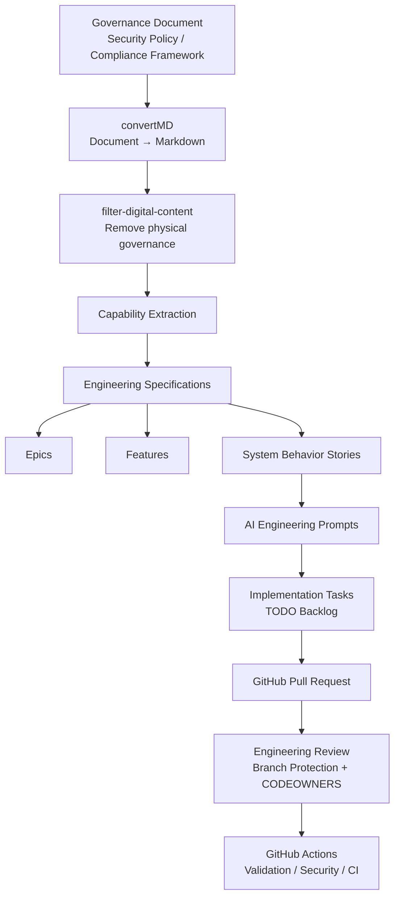

# Muse Platform Architecture

Muse converts governance requirements into engineering capabilities and integrates them directly into GitHub development workflows.

The system implements a **governance → capability → engineering → pull request pipeline** that allows organizations to operationalize compliance as code.

---

## Governance → Engineering Pipeline



---

## Artifact Layers

Muse produces layered engineering artifacts derived directly from governance requirements.

```
Governance
   ↓
Capabilities
   ↓
Epics
   ↓
Features
   ↓
System Behavior Stories
   ↓
AI Implementation Prompts
   ↓
Implementation Tasks
   ↓
Pull Request
```

Each artifact preserves traceability back to the original governance source.

---

## Repository Structure

The repository follows a spec-driven architecture commonly used in modern platform engineering systems.

```
muse/

cli/
pipeline/
generators/

specs/
  governance/
  capabilities/
  epics/
  features/
  stories/

prompts/
  stories/

tasks/
  TODO.md

decisions/
  ADR-001-governance-capabilities.md
```

---

## Traceability Model

Muse maintains full lineage between governance requirements and engineering implementation.


This traceability allows organizations to answer critical governance questions:

* Which engineering capabilities satisfy a governance control?
* Which system behaviors implement that capability?
* Which code changes implement the behavior?

---

## GitHub Platform Integration

Muse integrates governance artifacts directly into GitHub development workflows.

```
Governance Document
        ↓
Muse CLI Pipeline
        ↓
Engineering Artifacts
        ↓
Git Commit
        ↓
Pull Request
        ↓
Branch Protection
        ↓
GitHub Actions Validation
```

Engineering teams review governance-derived work using the same collaboration model used for code.

---

## Benefits

Muse enables organizations to:

• Convert governance requirements into engineering capabilities
• Deliver compliance work directly into GitHub workflows
• Maintain traceability between policy and implementation
• Accelerate secure development using AI-assisted coding prompts
• Operationalize governance as code
